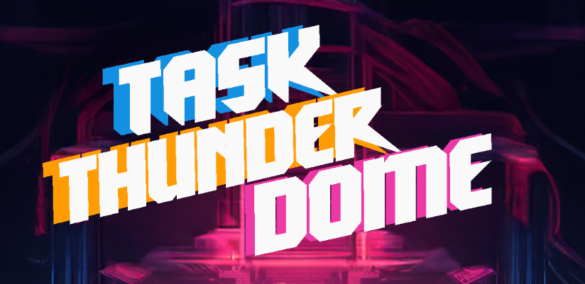

## Welcome to the Task Thunderdome!

Overwhelming task lists can be stressful and hinder productivity. Our app provides a solution that helps users organize and prioritize their tasks with a fun tournament style bracket!

# Installation
To run our Android app, follow these steps:

1. **Download Android Studio:**
   - [Android Studio](https://developer.android.com/studio)

2. **Install the Android SDK:**
   - Ensure the Android SDK is installed during the Android Studio setup.

3. **Clone our Repository**

4. **Configure Virtual Device: (or read below for alternatives)**
   - Open Android Studio and access the device manager.
   - Set up a Pixel 6 virtual device.
   - Download the "UpsideDownCake" OS for the virtual device.

5. **Download System Image:**
   - Download the system image for the Pixel 6 virtual device.
   - Verify the configuration once the download is complete.

6. **Run the App:**
   - Run the app on the device manager.
   - Have fun!

**Alternatively:**
   - Run the app on an Android device.
   - Enable developer settings on the device.
   - Connect the device to the computer.

# Technologies Used
- Kotlin
- Jetpack Compose
- Python
- Flask
   
# Team Members
- Ankit Ahlwat
- Lucas Angelozzi
- Cam Fung
- Elsa Ho
  Andy Nguyen
- Justin Viacrusis

